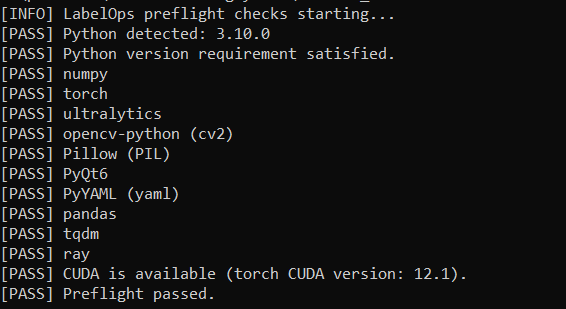

# LabelOps - Setup and Preflight Guide

This guide explains how to install LabelOps and verify your environment with the new `run_tests.bat` preflight checker.

## Quick Setup

From project root:

```bash
python -m venv .venv
# Windows
.venv\Scripts\activate
# Linux/macOS
# source .venv/bin/activate

pip install -r src/requirements.txt
```

Run the app:

```bash
python src/main.py
```

## Windows Preflight Check

Run:

```batch
cd src
run_tests.bat
```

The checker is intentionally minimal and professional:
- `PASS` for healthy checks
- `WARNING` for optional/non-critical issues
- `FAIL`/`ERROR` for major blocking issues

It checks:
- Python availability and version (`3.10+`)
- Required modules:
  - `numpy`
  - `torch`
  - `ultralytics`
  - `opencv-python (cv2)`
  - `Pillow (PIL)`
  - `PyQt6`
  - `PyYAML (yaml)`
- Optional modules:
  - `pandas`
  - `tqdm`
  - `ray`
- GPU/CUDA availability (warning only if unavailable)

## Ideal Output (Example)



## How to Read Results

- If you see only `PASS` (or `PASS` with `WARNING`), you can proceed.
- If you see `FAIL` or final `ERROR`, resolve those issues first.

Typical warnings:
- `GPU/CUDA is unavailable. CPU mode will be used.`
- Missing optional modules such as `ray` (background training features may be limited).

Typical major failures:
- Python missing
- Python version too old
- Missing required modules

## Fix Common Issues

Install/repair dependencies:

```bash
pip install -r src/requirements.txt
```

If CUDA is required for your workflow, install CUDA-enabled PyTorch from:

https://pytorch.org/get-started/locally/

## Notes

- `run_tests.bat` does not use score/grade output.
- It is designed for clean CI/local preflight validation with clear actionable messages.
