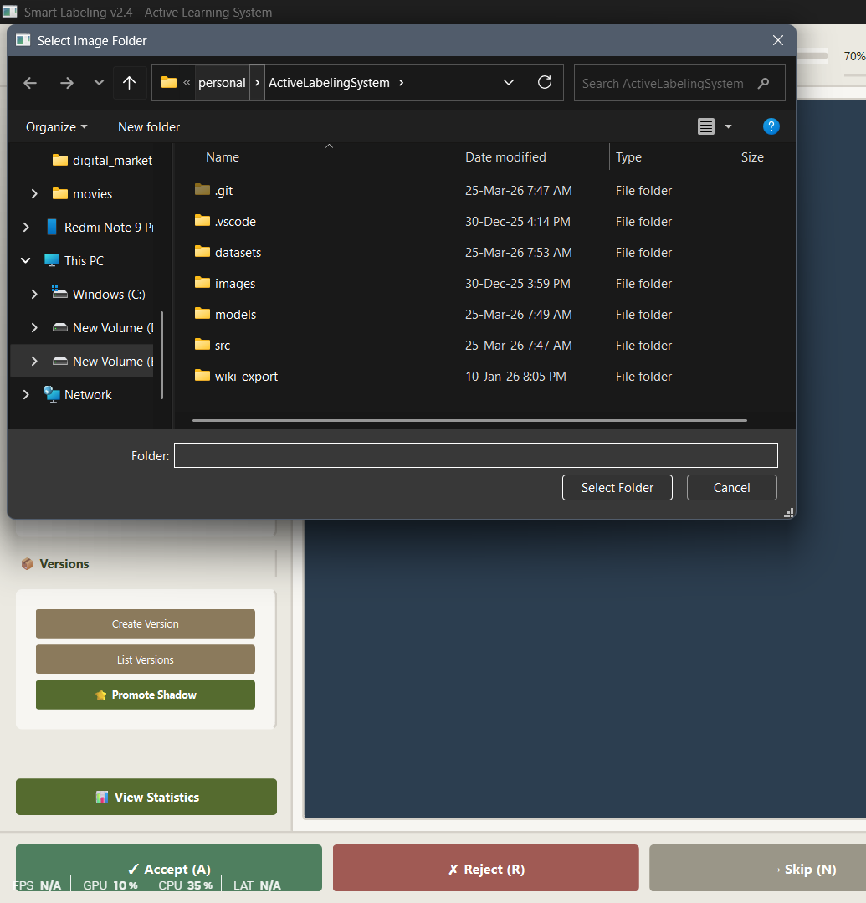
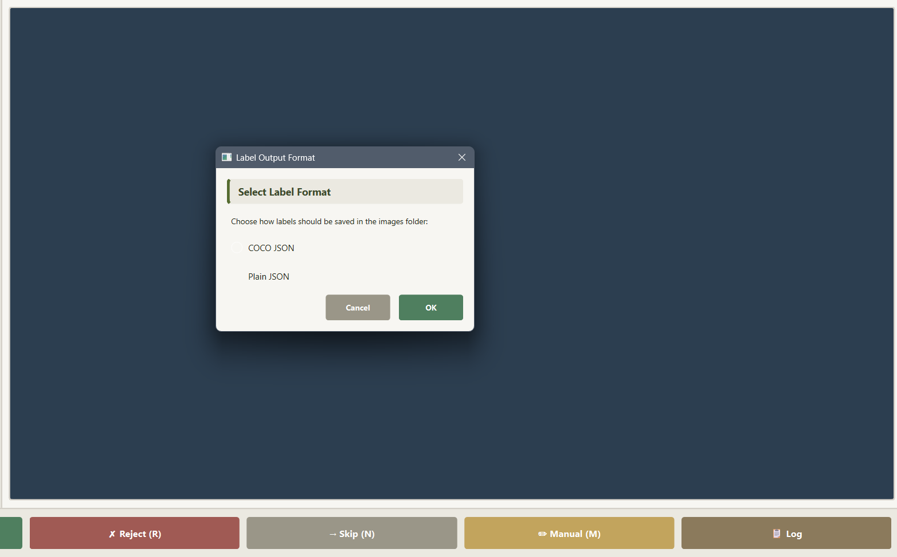
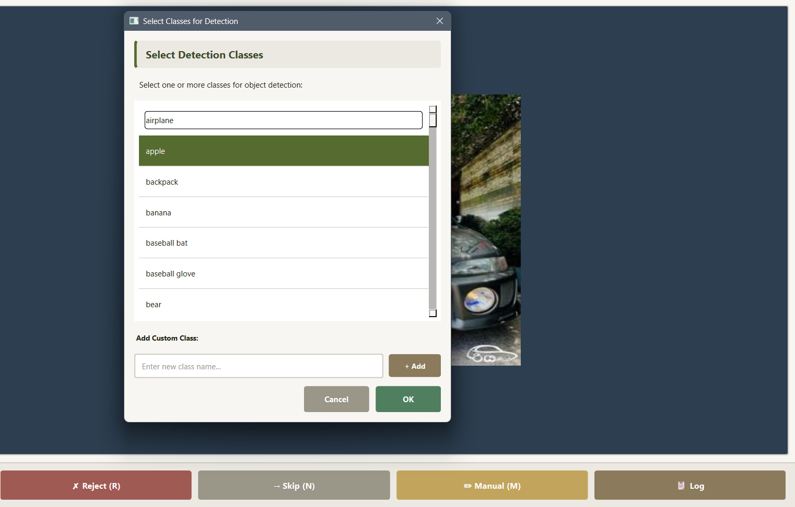
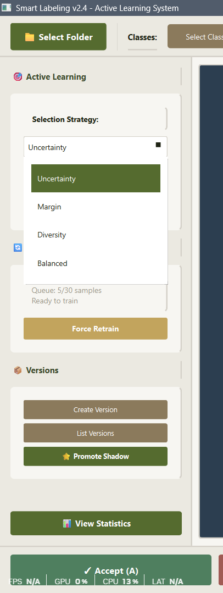
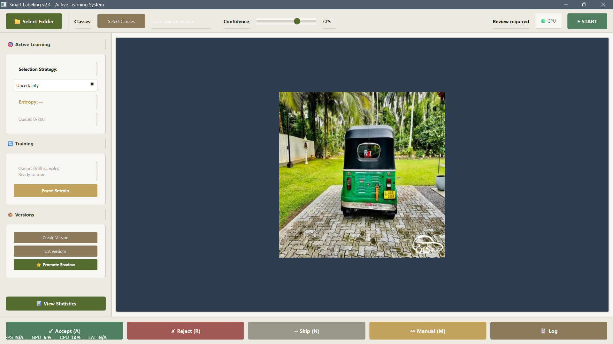
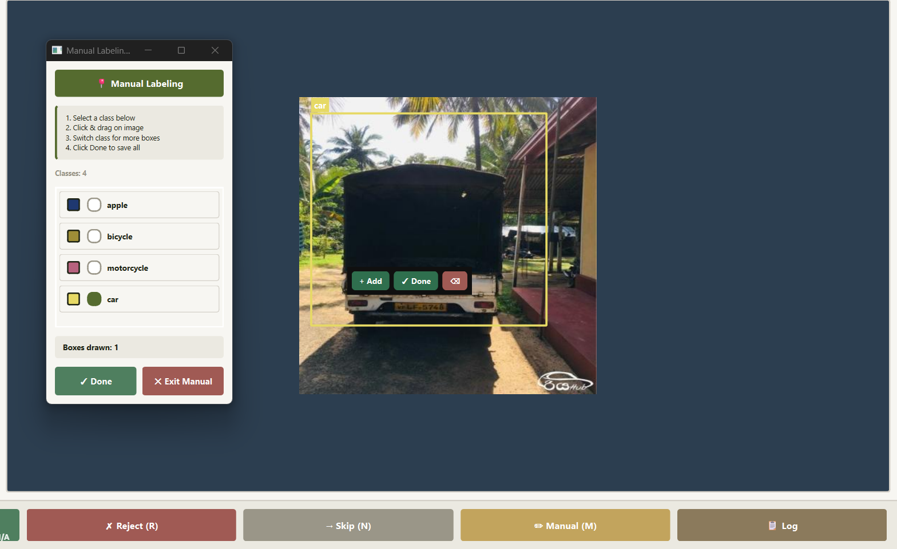
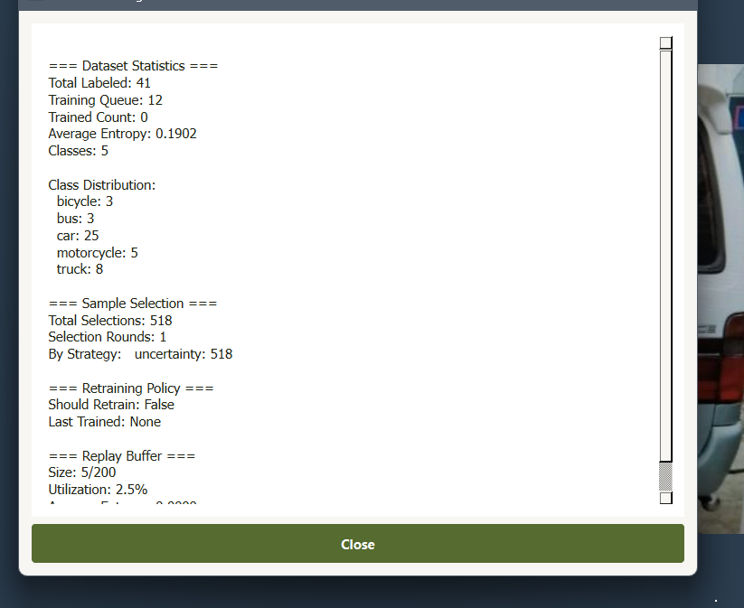

# ActiveLabelingSystem

Formerly known as **LabelOps**.

Local-first AI-assisted image labeling with active learning, manual box tools, background retraining, and dataset version snapshots.

## What is new

- Modular app structure (`src/app`, `src/core`, `src/features`) for cleaner maintenance.
- Active learning image prioritization when loading folders (unlabeled images first, sorted by uncertainty).
- Retraining policy engine with multi-signal checks (sample count, time, entropy shift, class balance, confidence drift).
- Dataset versioning from UI with metadata, hash integrity, and manifest tracking.
- Label format selection at folder load time: `COCO JSON` or `Plain JSON`.
- Safer persistence:
  - autosave per folder (`labels_autosave.json`)
  - internal state store (`.labels_internal.json`)
  - atomic file writes for exports.
- Improved manual labeling UX:
  - floating toolbox
  - quick class switching (1-9)
  - undo/delete shortcuts
  - inline floating action toolbar.
- Better training controls in UI:
  - force retrain
  - live queue/training status
  - shadow model promotion with validation warning flow.

## Features

### Active learning and triage

- Entropy-aware detection metadata is attached to predictions.
- Folder loading prioritizes unlabeled images for high-value review.
- Replay buffer preserves historical samples for continual learning.

### Retraining workflow

- Background training via Ray shadow trainer.
- Training trigger policy requires minimum sample count plus at least one urgency signal.
- Promotion flow supports validation and explicit override confirmation.

### Dataset versioning

- Create version snapshots from current labels.
- Stores YOLO-style labels, copied images, metadata, and a dataset hash.
- Keeps lineage and latest pointer in `src/datasets/manifest.json`.

### Label export

- `Plain JSON` output (`labels.json`) for direct app consumption.
- `COCO JSON` output (`labels_coco.json`) for downstream ML pipelines.

### Manual labeling mode

- Draw boxes directly on the canvas.
- Per-box class assignment with deterministic class colors.
- Save-and-next loop without leaving manual mode.

## Project structure

```text
ActiveLabelingSystem/
  images/
  src/
    app/
      window.py
      dialogs.py
      state.py
      actions.py
    core/
      data_manager.py
      entropy.py
      sample_selector.py
      retrain_policy.py
      dataset_versioner.py
      replay_buffer.py
      shadow_trainer.py
      training_orchestrator.py
      model_manager.py
      feedback_validator.py
    features/
      manual.py
      shortcut_manager.py
      shortcut_config.py
      toolbar_manager.py
      toolbar_widget.py
      toolbar_styles.py
    datasets/
    models/
    main.py
    requirements.txt
    run_tests.bat
  README.md
  GUID.md
```

## Installation

```bash
git clone https://github.com/sairam-s0/ActiveLabelingSystem.git
cd ActiveLabelingSystem
python -m venv .venv
# Windows
.venv\Scripts\activate
# Linux/macOS
# source .venv/bin/activate

pip install .
```

Users can install it directly with:

```bash
pip install Active-Labeling-System
```

## Run the app

After install, run the bootstrap/setup command first:

```bash
als
```

This command:

- runs `run_tests.bat` on Windows
- checks Python and runtime dependencies
- installs missing packages automatically
- detects GPU hardware
- installs CUDA-enabled PyTorch automatically for NVIDIA GPUs
- falls back to CPU mode for unsupported GPU setups

After setup completes, start the GUI with:

```bash
als --start
```

## How to use

### 1. Select image folder and output format

- Click `Select Folder`.
- Choose output format:
  - `COCO JSON` -> writes `labels_coco.json`
  - `Plain JSON` -> writes `labels.json`
- The app also keeps internal state in `.labels_internal.json` and autosave in `labels_autosave.json` inside the selected folder.




### 2. Select classes

- Click `Select Classes`.
- Pick one or more classes.
- Add custom classes from the same dialog when needed.



### 3. Start labeling

- Click `START`.
- Review detections and use bottom actions:
  - `Accept (A)`
  - `Reject (R)`
  - `Skip (N)`
  - `Manual (M)`



### 4. Manual mode (box drawing)



- Draw boxes by click-drag on canvas.
- Save boxes and move next with:
  - `Space` or `Enter` -> save and next
  - `Esc` -> exit manual mode
  - `Ctrl+Z` -> undo last box
  - `Delete` -> delete last box
  - `1..9` -> switch class index



### 5. Monitor active learning and training

- Left panel shows:
  - entropy of current image
  - queue size
  - training progress/status.
- Use `Force Retrain` if you want to bypass normal policy checks (still requires minimum samples).



### 6. Version and promote

- `Create Version` creates a dataset snapshot in `src/datasets/v_YYYYMMDD_HHMMSS/`.
- `List Versions` shows stored versions and metadata.
- `Promote Shadow` promotes trained candidate model to active model.

## Output files and artifacts

For each selected image folder:

- `labels.json` or `labels_coco.json` (selected format)
- `.labels_internal.json` (internal metadata store)
- `labels_autosave.json` (session recovery)

## Notes

- If Ray is unavailable, labeling still works; background training features are reduced.
- If class mapping is not available yet, trainer creation waits until first labels are saved.
- Restart app after model promotion for a clean reload of active weights.

## Contributing

Please read `CONTRIBUTING.md`.

## License

MIT. See `LICENSE`.
