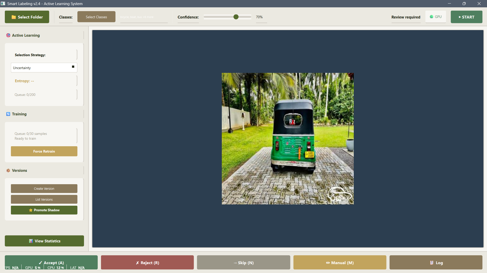
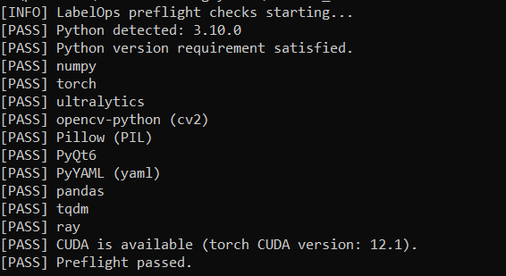
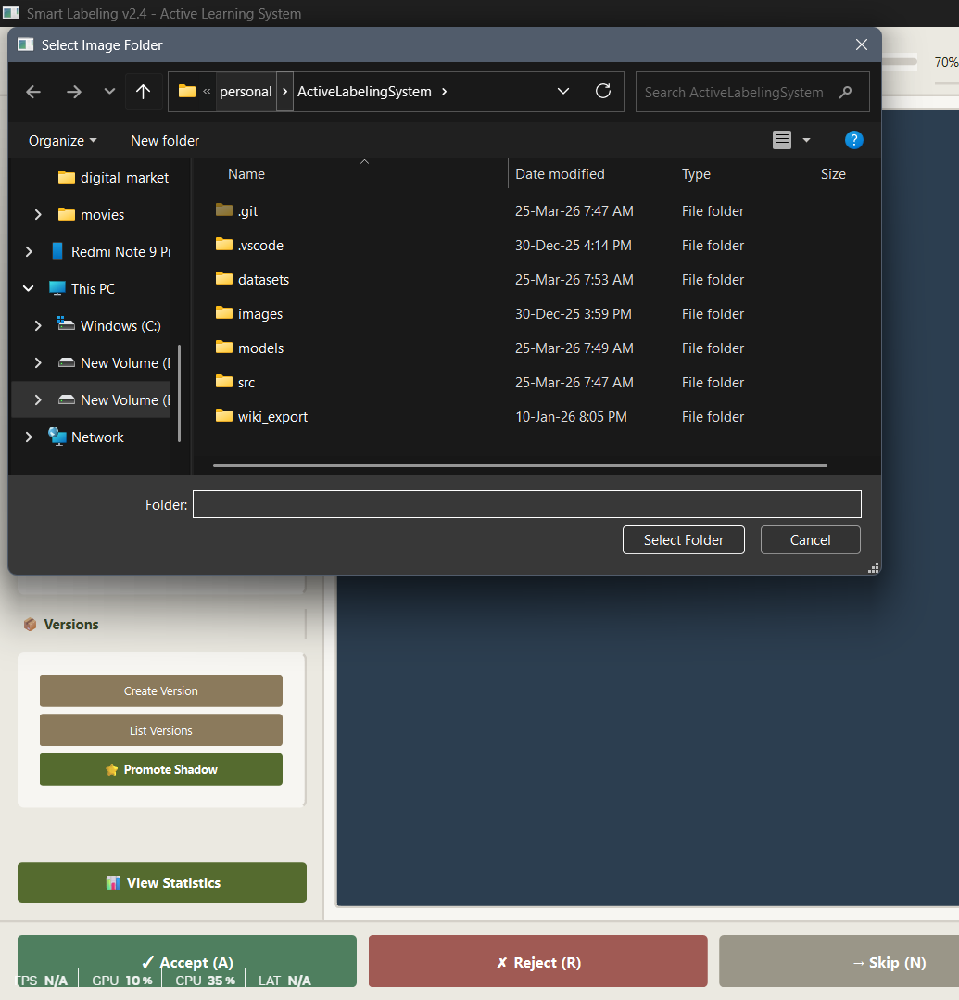
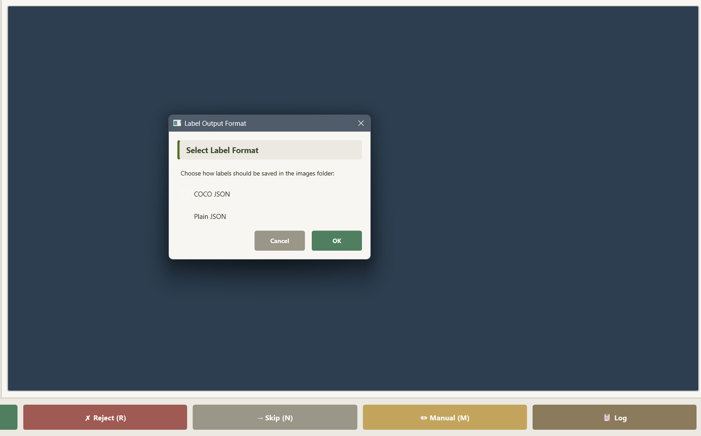
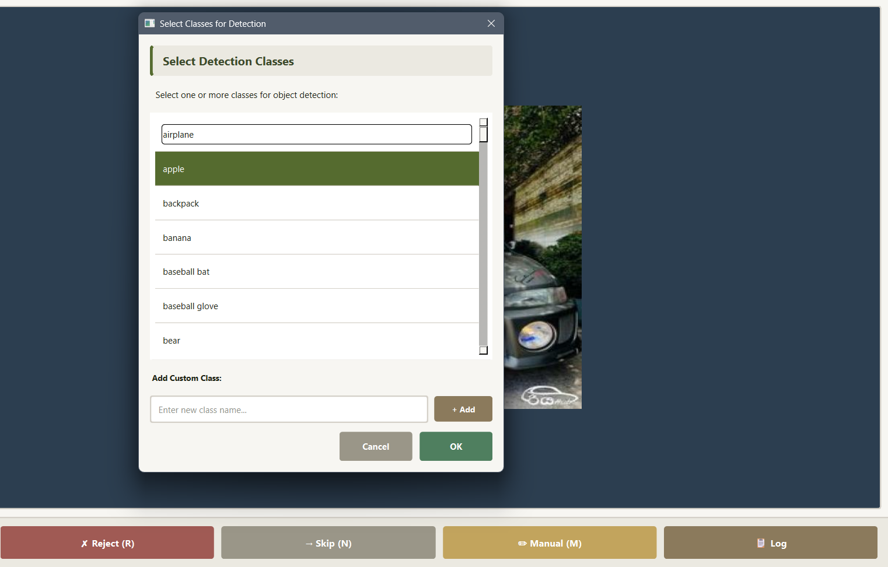
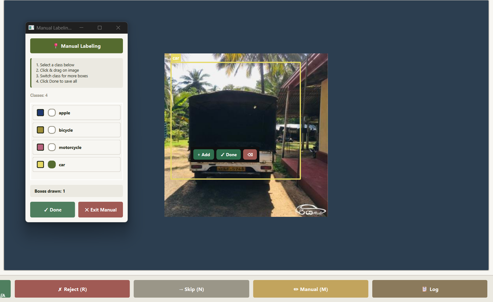
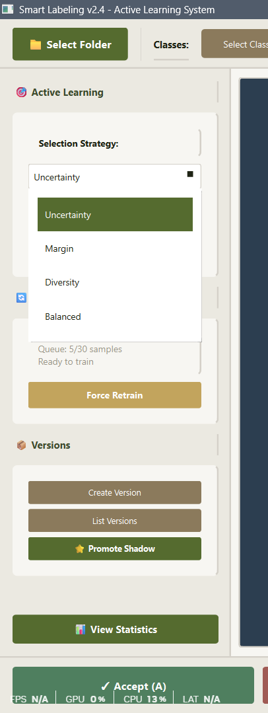
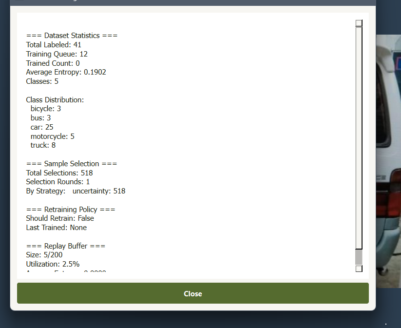

<div align="center">


# Active Labeling System

**Local-first AI-assisted image labeling with active learning, background retraining, and dataset version snapshots.**

Formerly known as **LabelOps**

[](https://www.python.org/)
[](https://doc.qt.io/qtforpython-6/)
[](https://docs.ultralytics.com/)
[](LICENSE)

[](https://pypi.org/project/Active-Labeling-System/)
[](https://pepy.tech/projects/active-labeling-system)
[](https://github.com/sairam-s0/ActiveLabelingSystem/issues)
[](https://github.com/sairam-s0/ActiveLabelingSystem)

---

[Installation](#installation) &nbsp;&bull;&nbsp; [Quick Start](#quick-start) &nbsp;&bull;&nbsp; [Usage Guide](#usage-guide) &nbsp;&bull;&nbsp; [Architecture](#project-architecture) &nbsp;&bull;&nbsp; [Contributing](#contributing)

</div>

<br/>

## Overview

Active Labeling System is a desktop application for AI-assisted image labeling that combines YOLO-based object detection with active learning strategies. It prioritizes the most informative images for human review, supports manual bounding box and freehand polygon annotation, and retrains models in the background -- all without requiring cloud connectivity.

<div align="center">
  
  <br/>
  <sub>Full application interface with detection overlay, review controls, and training status panel.</sub>
</div>

<br/>

## Key Features

<table>
  <tr>
    <td width="50%">
      <h3>Active Learning and Triage</h3>
      <ul>
        <li>Entropy-aware detection metadata attached to predictions</li>
        <li>Folder loading prioritizes unlabeled images for high-value review</li>
        <li>Strategy selector: <code>Uncertainty</code>, <code>Margin</code>, <code>Diversity</code>, <code>Balanced</code></li>
        <li>Replay buffer preserves historical samples for continual learning</li>
      </ul>
    </td>
    <td width="50%">
      <h3>Background Retraining</h3>
      <ul>
        <li>Background training via Ray shadow trainer</li>
        <li>Multi-signal policy: sample count, time, entropy shift, class balance, confidence drift</li>
        <li>Shadow model promotion with validation warning flow</li>
        <li>Force retrain override from UI</li>
      </ul>
    </td>
  </tr>
  <tr>
    <td width="50%">
      <h3>Manual Annotation</h3>
      <ul>
        <li>Bounding box drawing by click-drag on canvas</li>
        <li>Freehand polygon regions for segmentation</li>
        <li>Per-box class assignment with deterministic colors</li>
        <li>Floating toolbox with mode switching and highlight toggle</li>
      </ul>
    </td>
    <td width="50%">
      <h3>Dataset Management</h3>
      <ul>
        <li>Version snapshots with YOLO-style labels, images, and metadata</li>
        <li>Hash integrity verification and manifest tracking</li>
        <li>Export as <code>COCO JSON</code> or <code>Plain JSON</code></li>
        <li>Atomic file writes, autosave, and internal state persistence</li>
      </ul>
    </td>
  </tr>
</table>

<br/>

## What's New in v0.2

| Category | Change |
|:---------|:-------|
| **Feature** | Freehand region labeling for polygon-style segmentation in manual mode |
| **Feature** | Manual toolbox mode switch between bounding boxes and freehand regions |
| **Feature** | Active learning strategy selector with four modes |
| **Feature** | Previous-image navigation and auto-accepted image log |
| **Update** | Modular app structure (`src/app`, `src/core`, `src/features`) |
| **Update** | Retraining policy engine with multi-signal checks |
| **Update** | Dataset versioning from UI with metadata and hash integrity |
| **Update** | Label format selection at folder load time |
| **Update** | Safer persistence: autosave, internal state store, atomic writes |
| **Update** | Improved manual labeling UX: floating toolbox, shortcuts, inline toolbar |
| **Update** | Better training controls: force retrain, live status, shadow promotion |

<br/>

## Installation

### From PyPI

```bash
pip install Active-Labeling-System
```

### From Source

```bash
git clone https://github.com/sairam-s0/ActiveLabelingSystem.git
cd ActiveLabelingSystem
python -m venv .venv
```

Activate the virtual environment:

```bash
# Windows
.venv\Scripts\activate

# Linux / macOS
source .venv/bin/activate
```

Install the package:

```bash
pip install .
```

For background training capabilities, include the optional training dependencies:

```bash
pip install ".[training]"
```

### System Requirements

| Requirement | Minimum |
|:------------|:--------|
| Python | 3.10+ |
| OS | Windows, Linux, macOS |
| GPU | Optional (NVIDIA with CUDA recommended for training) |

<br/>

## Quick Start

Run the bootstrap and preflight check:

```bash
als
```

This command performs the following:

- Runs `run_tests.bat` on Windows
- Checks Python version and runtime dependencies
- Installs missing packages automatically
- Detects GPU hardware and installs CUDA-enabled PyTorch for NVIDIA GPUs
- Falls back to CPU mode for unsupported GPU setups

<div align="center">
  
  <br/>
  <sub>Preflight check and setup output.</sub>
</div>

<br/>

Once setup completes, launch the GUI:

```bash
als --start
```

<br/>

## Usage Guide

### 1. Select Image Folder and Output Format

Click **Select Folder** and choose the output format:

- **COCO JSON** -- writes `labels_coco.json`
- **Plain JSON** -- writes `labels.json`

The app maintains internal state in `.labels_internal.json` and session recovery in `labels_autosave.json` inside the selected folder.

<div align="center">
  
  &nbsp;&nbsp;
  
</div>

### 2. Select Classes

Click **Select Classes** to pick one or more detection classes. Custom classes can be added from the same dialog.

<div align="center">
  
</div>

### 3. Start Labeling

Click **START** to begin the review loop. Use the bottom action bar:

| Action | Shortcut | Description |
|:-------|:---------|:------------|
| Previous | `P` | Navigate to the previous image |
| Accept | `A` | Accept current detections |
| Reject | `R` | Reject current detections |
| Skip | `N` | Skip to next image |
| Manual | `M` | Enter manual labeling mode |
| Log | -- | View auto-accepted image log |

### 4. Manual Annotation Mode

<div align="center">
  
  <br/>
  <sub>Manual labeling interface with bounding box and freehand region tools.</sub>
</div>

<br/>

Draw bounding boxes by click-dragging on the canvas. Switch to **Freehand Region** in the toolbox for polygon annotation. In freehand mode, click to place points, then double-click, right-click, or click **Finish Region** to close the shape.

**Keyboard Shortcuts:**

| Shortcut | Action |
|:---------|:-------|
| `Space` / `Enter` | Save annotations and move to next image |
| `Esc` | Exit manual mode |
| `Ctrl+Z` | Undo last box |
| `Backspace` | Undo last freehand point |
| `Delete` | Delete last box |
| `1` -- `9` | Switch class index |

### 5. Monitor Active Learning and Training

The left panel displays:

- Entropy score of the current image
- Queue size and position
- Training progress and status

Use **Force Retrain** to bypass normal policy checks (minimum sample requirement still applies).

<div align="center">
  
  &nbsp;&nbsp;
  
</div>

### 6. Versioning and Model Promotion

- **Create Version** -- creates a dataset snapshot in `src/datasets/v_YYYYMMDD_HHMMSS/`
- **List Versions** -- displays stored versions and metadata
- **Promote Shadow** -- promotes the trained candidate model to the active model

<br/>

## Output Files

For each selected image folder, the following files are generated:

| File | Purpose |
|:-----|:--------|
| `labels.json` or `labels_coco.json` | Exported annotations in the selected format |
| `.labels_internal.json` | Internal metadata store |
| `labels_autosave.json` | Session recovery autosave |

<br/>

## Project Architecture

```text
ActiveLabelingSystem/
  images/                         # Screenshots and logo assets
  src/
    app/
      window.py                   # Main application window
      dialogs.py                  # Dialog components
      state.py                    # Application state management
      actions.py                  # UI action handlers
    core/
      data_manager.py             # Data I/O and persistence
      entropy.py                  # Entropy computation
      sample_selector.py          # Active learning sample selection
      retrain_policy.py           # Multi-signal retraining policy
      dataset_versioner.py        # Dataset snapshot versioning
      replay_buffer.py            # Continual learning replay buffer
      shadow_trainer.py           # Ray-based background trainer
      training_orchestrator.py    # Training lifecycle coordination
      model_manager.py            # Model loading and management
      feedback_validator.py       # Promotion validation
    features/
      manual.py                   # Manual annotation mode
      shortcut_manager.py         # Keyboard shortcut handling
      shortcut_config.py          # Shortcut key configuration
      toolbar_manager.py          # Floating toolbar logic
      toolbar_widget.py           # Toolbar UI widget
      toolbar_styles.py           # Toolbar styling
    datasets/                     # Versioned dataset snapshots
    models/                       # Trained model weights
    main.py                       # Application entry point
  pyproject.toml                  # Build configuration and metadata
  README.md
  CONTRIBUTING.md
  DOCUMENTATION.md
  LICENSE
```

<br/>

## Roadmap

- [ ] SAM (Segment Anything Model) integration
- [ ] GPU parallel processing
- [ ] OCR text labeling
- [ ] Video frame labeling

<br/>

## Notes

- If Ray is unavailable, labeling still works; background training features are reduced.
- If class mapping is not yet available, trainer creation waits until labels are first saved.
- Restart the application after model promotion for a clean reload of active weights.

<br/>

## Contributing

Contributions are welcome. Please read [CONTRIBUTING.md](CONTRIBUTING.md) for guidelines on submitting pull requests, reporting bugs, and coding standards.

## License

This project is licensed under the Apache License 2.0. See [LICENSE](LICENSE) for full terms.

---

<div align="center">
  <sub>Built with Python, PyQt6, and Ultralytics YOLOv8</sub>
</div>
